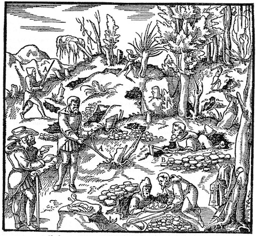
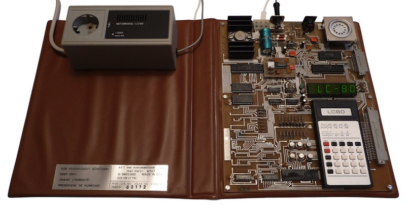
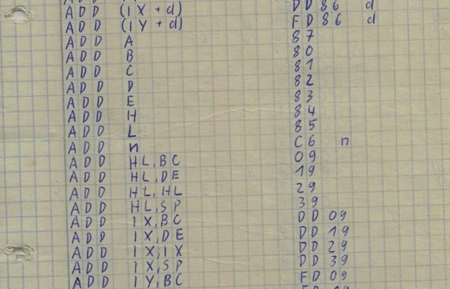
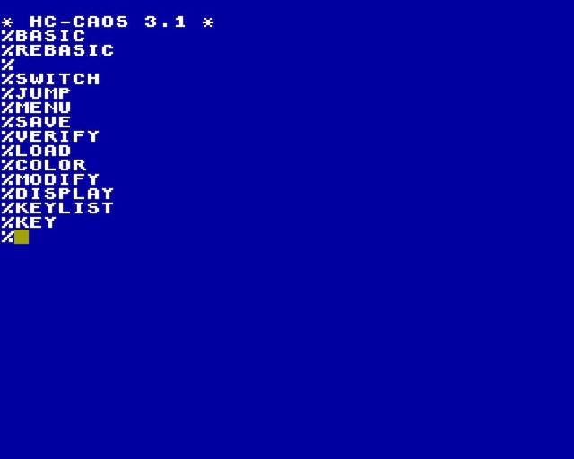
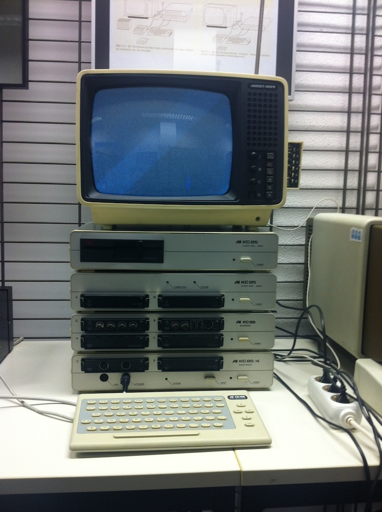

## A Bit of History

I grew up in East-Germany during the 70's and 80's near the
small town of Schwarzenberg close to the Czech border in a region called Erzgebirge.
'Erzgebirge' literally translates to 'Ore Mountains' for the rich deposits 
of iron and silver ore which were mined here between the 13th 
and 17th century. If you have read Neal Stephenson's Baroque Cycle: Jack and Eliza 
must have crossed the mountains somewhere nearby when they travelled from 
Joachimsthal to Leipzig.

In the dark ages, before the Erzgebirge was colonized by settlers, the mountains 
were sometimes called "Miriquidi", which is a Latin bastardization of the northern 
word Mirkvidr, meaning the "Dark Wood" which separated the barbarian hordes
of Attila the Hun from the slightly less barbarian German tribes.

Tolkien's "Mirkwood" (or "Duesterwald" as it is called in the German
translation) is directly derived from the word Mirkvidr. So Middle-Earth's Mirkwood is
actually Earth's Erzgebirge, and should you travel there during a cold and rainy
November day, you'll see that this is the truth.

    

    
Early hackers at work

Mining was barely profitable after the Spaniards flooded
the market with cheap American silver from Potosi in the 16th and 17th century, 
the miners basically became early victims of what today is called globalization, 
and for a few hundred years it became quiet in the Erzgebirge until after WWII 
when suddenly a new 
<a href="http://en.wikipedia.org/wiki/Berggeschrey" target="_blank">Berggeschrey</a>
happened.

When the Americans and Soviets moved in and won the war, they left a
small triangle unoccupied in south-eastern Germany, right around
Schwarzenberg for almost two months. Nobody really knows why, and there's 
a good amount of conspiracy theories around it. Today this short era is 
known as the "Free Republic of Schwarzenberg", a wonderfully utopian name that
never existed in reality. The truth behind it is probably very simple. 
The Soviets, coming from the East, seemed to have stopped where planned, 
but the Americans moving in from the West started to run out of fuel, 
and didn't consider the no-mans-land ahead to be important enough to 
move in full-force, since the war was already over anyway.

At least that's the story I heard about 10 years ago from an
American WWII veteran via email (supposedly a survivor of the famous 
101st Airborne Division) who claimed to have seen the end of WWII as a POW 
in Schwarzenberg. Take this with a grain of salt, I have no way of proving 
whether this is fact or fiction ;)

Fact is though that right after the war, after the Soviets moved in and the Americans 
out of East Germany, one of the biggest mining operations in history started 
when huge amounts of Uranium were discovered, which in the
following 30 years became the main source of Uranium for the Soviet nuclear
weapons program.

## 1984

Some time in 1984, when I was a 12 year old boy, my older brother brought 
a strange electronic device home from work: an 
LC-80. The LC ist short for Lerncomputer (Learning Computer). 
This was a minimalistic 8-bit computer with a Z80-compatible CPU, and a whopping
1 kByte of RAM (of which only 256 bytes were actually usable for machine code
if I remember right). This thing was unlike any western computer of the
late 70's or 80's. It wasn't connected to a TV, but there was
a seven-segment LED display with 4 digits for the address and 2 digits for content.
Instead of a QWERTY keyboard there was the casing of a pocket calculator which allowed 
to input hexadecimal numbers.

    

    
An LC-80 in all its glory

I was immediately hooked by the mysterious aura of the device, but didn't really 
know what I was doing. The manual was complete gibberish to me, but I was able
to type example code I didn't understand into the machine and get some blinking
lights and beeping sounds as output.

Then after a few months, some mystical transformation happened. 
Within 2 or 3 days somehow I "knew" programming. The
assembly instructions and registers suddenly made sense to me and I 
realized how I could arrange them differently, and that I could write
a simple, working program that WASN'T printed in the manual! From this
moment on I knew that I was to be a programmer.

Programming on the LC-80 was simple and straight forward: usually one scribbled
the assembly instructions on paper, and translated them manually to hexadecimal
machine code using a translation table and then type the machine code byte by byte 
into memory, while executing the code in mind to keep track of the CPU state.
After a while the machine code for the most common assembly instructions was burned 
forever into the subconscious and the table lookups were needed less and less. 
Still works today: JMP is 0xC3,
CALL is 0xCD, RET is 0xC9, LD HL,nnnn -> 0x21, and so on :P

    

    
Part of my old Z80 translation table from almost 30 years ago

There wasn't a lot of interesting stuff to do on this little machine, you could
turn the 42 segments of the LED display on and off and you could output an 
audio signal by setting a frequency in some hardware register. 

One could generate some pretty cool sound effects though by manipulating the audio frequency
in a loop, and control the time between frequency changes with an embedded loop of NOPs, 
but this was the most advanced stuff I got out of the LC-80 and it got boring pretty fast.

## The Eastern 8-bit Era

Thankfully just around that time several other 8-bit computers had been developed
in the GDR, first there was the <a href="http://de.wikipedia.org/wiki/Z1013" target="_blank">Z-1013</a>, 
aimed at hobbyists who could handle a soldering iron. Then there was the 
<a href="http://en.wikipedia.org/wiki/Z9001" target="_blank">Z9001</a>, which looked more
like a proper computer. The most advanced 8-bit machine of the mid-80s was the 
<a href="http://en.wikipedia.org/wiki/KC_85" target="_blank">KC85/3</a> though. 

This marvellous machine was probably the most innovative 8-bitter built in the entire Soviet Bloc. 
Although the low level components were straight copies of Western chips, the overall design featured
some really nifty ideas both in hardware and software. 

It could do 320x256 pixels in 16+8 colors (but only one foreground and one background color 
in an 8x4 pixel block), it had 16 kByte of general purpose RAM, 16 kByte of video RAM, and 
an 16 kByte ROM with a proper operating system in it (and a useless BASIC interpreter). It was no 
games machine however, the CPU was faster then a C64, but the video RAM had a terrible memory layout, 
there were no sprites, and there was no real sound chip, just simple frequency output. But it was the
closest thing to a gaming computer we could get in the East.

The operating system was actually really clever since it was highly modular. Small pieces
of program code could be loaded side by side into memory, each of those commands had
a distinctive 2-byte magic header (7F 7F) followed by the ASCII name of the command,
and terminated by an 01 byte, then the machine code, which ended with a RET (C9)
to return to the operating system. When the machine booted up, or optionally initiated by hand, 
a complete memory scan through RAM and ROM was performed, looking for the magic 7F7F headers, and
an onscreen menu of all found commands was built which could then be called from a
command line (so you didn't have to remember them). Bigger program packages (like an
Assembler, a FORTH interpreter, or a PASCAL compiler) often simply consisted of a number
of such commands.

    

    
The KC85/3 shell with the default commands in ROM

But the killer feature of the KC85 line was the extensibility of the hardware. The base unit had 2 
module slots, and a nearly infinite number of extension units with 4 slots each
could be stacked on top of it. In theory, you could have 4MB(!) of RAM bank-switched
into a 16 kByte memory hole. This nicely preserved KC85/4 in the small computer museum
of the HTW Oberschoeneweide in Berlin gives you an idea:

    

    
A properly stacked KC 85/4

