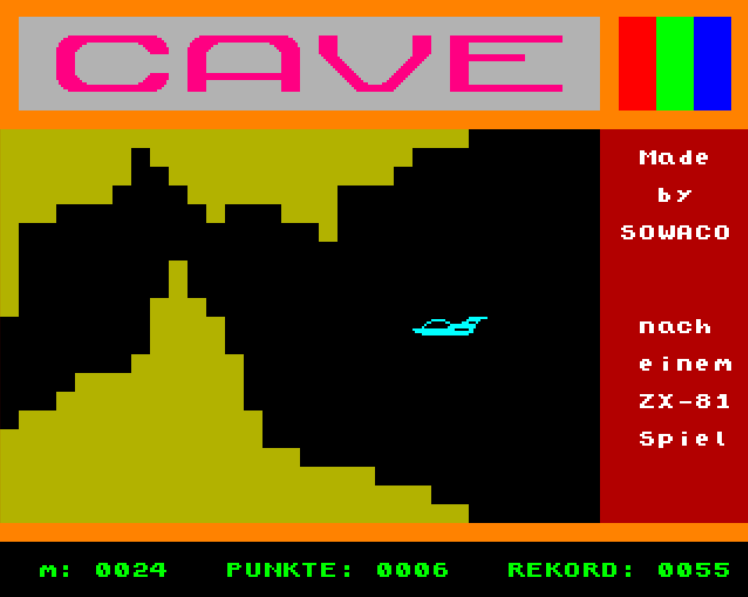

<!--
## A Bit of History

I grew up in East-Germany during the 70's and 80's near the
small town of Schwarzenberg close to the Czech border in a region called Erzgebirge.
'Erzgebirge' literally translates to 'Ore Mountains' for the rich deposits 
of iron and silver ore which were mined here between the 13th 
and 17th century. 

In the dark ages, before the Erzgebirge was colonized by settlers, the mountains 
were sometimes called "Miriquidi", which is a Latin bastardization of the northern 
word Mirkvidr, meaning the "Dark Wood" which separated the barbarian hordes
of Attila the Hun from the slightly less barbarian German tribes.

Tolkien's "Mirkwood" (or "Duesterwald" as it is called in the German
translation) is directly derived from the word Mirkvidr. So Middle-Earth's Mirkwood is
actually Earth's Erzgebirge, and should you travel there during a cold and rainy
November day, you'll see that this is the truth.

    

    
Early hackers at work

Mining was barely profitable after the Spaniards flooded
the market with cheap American silver from Potosi in the 16th and 17th century, 
the miners basically became early victims of what today is called globalization, 
and for a few hundred years it became quiet in the Erzgebirge until after WWII 
when suddenly a new 
<a href="http://en.wikipedia.org/wiki/Berggeschrey" target="_blank">Berggeschrey</a>
happened.

When the Americans and Soviets moved in and won the war, they left a
small triangle unoccupied in south-eastern Germany, right around
Schwarzenberg for almost two months. Nobody really knows why, and there's 
a good amount of conspiracy theories about this. Today this short era is 
known as the "Free Republic of Schwarzenberg", a wonderfully utopian name that
never existed in reality. The truth behind it is probably very simple. 
The Soviets, coming from the East, seemed to have stopped where planned, 
but the Americans moving in from the West started to run out of fuel, 
and didn't consider the no-mans-land ahead to be important enough to 
move in full-force, since the war was already over anyway.

At least that's the story I heard about 10 years ago from an
American WWII veteran via email (supposedly a survivor of the famous 
101st Airborne Division) who claimed to have seen the end of WWII as a POW 
in Schwarzenberg. Take this with a grain of salt, I have no way of proving 
whether this is fact or fiction ;)

Fact is though that right after the war, after the Soviets moved in and the Americans 
out of East Germany, one of the biggest mining operations in history started 
when huge amounts of Uranium were discovered, which in the
following 30 years became the main source of Uranium for the Soviet nuclear
weapons program.
-->

## 1984

Some time in 1984, when I was a 12 year old boy, my older brother brought 
a strange electronic device home from work: an 
LC-80. The LC ist short for Lerncomputer (Learning Computer). 
This was a minimalistic 8-bit computer with a Z80-compatible CPU, and a whopping
1 kByte of RAM. This thing was unlike any western computer of the
late 70's or 80's. It wasn't connected to a TV, but there was
a seven-segment LED display with 4 digits for the address and 2 digits for content.
Instead of a QWERTY keyboard there was the casing of a pocket calculator which allowed 
to input hexadecimal numbers.

    

    
An LC-80 in all its glory

I was immediately hooked by the mysterious aura of the device, but didn't really 
know what I was doing. The manual was complete gibberish to me, but I was able
to type example code I didn't understand into the machine and get some blinking
lights and beeping sounds as output.

Then after a few months, some mystical transformation happened. 
Within 2 or 3 days somehow I "knew" programming. The
assembly instructions and registers suddenly made sense to me and I 
realized how I could arrange them differently, and that I could write
a simple, working program that WASN'T printed in the manual! From this
moment on I knew that I was to be a programmer.

Programming on the LC-80 was simple and straight forward: usually one scribbled
the assembly instructions on paper, and translated them manually to hexadecimal
machine code using a translation table and then type the machine code byte by byte 
into memory, while executing the code in mind to keep track of the CPU state.
After a while the machine code for the most common assembly instructions was burned 
forever into the subconscious and the table lookups were needed less and less. 
Still works today: JMP is 0xC3,
CALL is 0xCD, RET is 0xC9, LD HL,nnnn -> 0x21, and so on :P

    

    
Part of my old Z80 translation table from almost 30 years ago

There wasn't a lot of interesting stuff to do on this little machine, you could
turn the 42 segments of the LED display on and off and you could output an 
audio signal by setting a frequency in some hardware register. 

One could generate some pretty cool sound effects though by manipulating the audio frequency
in a loop, and control the time between frequency changes with an embedded loop of NOPs, 
but this was the most advanced stuff I got out of the LC-80 and it got boring pretty fast.

## The Eastern 8-bit Era

Thankfully just around that time several other 8-bit computers had been developed
in the GDR, first there was the <a href="http://de.wikipedia.org/wiki/Z1013" target="_blank">Z-1013</a>, 
aimed at hobbyists who could handle a soldering iron. Then there was the 
<a href="http://en.wikipedia.org/wiki/Z9001" target="_blank">Z9001</a>, which looked more
like a proper computer. The most advanced 8-bit machine of the mid-80s was the 
<a href="http://en.wikipedia.org/wiki/KC_85" target="_blank">KC85/3</a> though. 

This marvellous machine was probably the most innovative 8-bitter built in the entire Soviet Bloc. 
Although the low level components were straight copies of Western chips, the overall design featured
some really nifty ideas both in hardware and software. 

It could do 320x256 pixels in 16+8 colors (but only one foreground and one background color 
in an 8x4 pixel block), it had 16 kByte of general purpose RAM, 16 kByte of video RAM, and 
an 16 kByte ROM with a proper operating system in it (and a useless BASIC interpreter). It was no 
games machine however, the CPU was faster then a C64, but the video RAM had a terrible memory layout, 
there were no sprites, and there was no real sound chip, just simple frequency output. But it was the
closest thing to a gaming computer we could get in the East.

The operating system was actually really clever since it was highly modular. Small pieces
of program code could be loaded side by side into memory, each of those commands had
a distinctive 2-byte magic header (7F 7F) followed by the ASCII name of the command,
and terminated by an 01 byte, then the machine code, which ended with a RET (C9)
to return to the operating system. When the machine booted up, or optionally initiated by hand, 
a complete memory scan through RAM and ROM was performed, looking for the magic 7F7F headers, and
an onscreen menu of all found commands was built which could then be called from a
command line (so you didn't have to remember them). Bigger program packages (like an
Assembler, a FORTH interpreter, or a PASCAL compiler) often simply consisted of a number
of such commands.

    

    
The KC85/3 shell with the default commands in ROM

But the killer feature of the KC85 line was the extensibility of the hardware. The base unit had 2 
module slots, and a nearly infinite number of extension units with 4 slots each
could be stacked on top of it. In theory, you could have 4MB(!) of RAM bank-switched
into a 16 kByte memory hole.

## Getting Serious

Typical for the top-down-controlled, 5-year plan driven GDR economy, there where not nearly
enough computers built to freely sell them in stores. Instead, schools and nationally-owned
companies got allowances of a few machines each. To make the best of this, computer clubs 
started to appear. Mostly on county-level because you couldn't really setup a computer club
at school with only a single computer. So after my experiments on the LC-80 I joined the
AG Computer in Schwarzenberg (AG = Arbeitsgemeinschaft, best translated with "study group"). Bernd
Beyreuther whom I still work with on computer games today, recommended the AG to me I think.

The AG was located in a magical place, the upper-most story of the keep of Castle Schwarzenberg.
Unfortunately our teachers could only give us access to the computers once a week for a few
evening hours. This meant that we had to write down and mentally debug our source code during the 
week (often during boring school lessons), and then use the valuable computer time to
type in the source code, and fix the remaining bugs. We only had Z1013s there, which only
supported 32x32 black-and-white ASCII graphics, not really the right stuff for computer games. 
But we were a bunch of nerds exploring programming together and generally having a great time.

I was dreaming of working on the just released KC85/3, and I soon found out that there was
indeed a way to obtain one, although difficult and expensive. My parents took the risk and 
went self-employed in the 80s, which was very uncommon in the East. As such they were
entitled to buy office hardware which normally wasn't available for citizens. Long story
short, I convinced my parents that we would need a computer for the office, and that the
KC85/3 would fit the requirements perfectly. It had a real keyboard, and while it was
very expensive (around 3.5k Mark), it was still a lot cheaper then real office computers
(at 20k Mark or more), for comparison, a car was between 10k and 30k Mark. Of course
they knew that a normal typewriter would have sufficed, but somehow I convinced them and
about half a year later, the ordered KC85/3 arrived (must have been end of 1985, or
beginning of 1986). Now I had access to a powerful home computer every day after school,
not in the evening of course, since I had to connect to the only TV in the household.

From now on, it went like this: Once a year a fair was happening in Schwarzenberg, with
a tent full of Western arcade machines. For 2 weeks, this tent was the center of my
universe. I devoured every single detail of the games, deconstructed them in my mind
and tried to figure out how they worked. The rest of the year I spent with creating
clones of those games on the KC85/3. Pretty poor clones most of the time to be honest,
but I learned to produce an entire computer game with graphics and sound, alone and
from scratch, all in Z80 assembly language. One game usually took between 6 weeks and 3 months.

Here's a couple of those early games, you might notice a few similarities to existing
games of the time ;)

    
  

    
My Breakout clone on the KC85/3 (running in an emulator)

    
  

    
...and the Pacman clone

    
  

    
'House', a little bit like Loderunner.

    
  

    
An actual side scroller called Cave, didn't really work well with the KC85/3 display hardware.

    

    
Labyrinth, my first shot at immersive 3D ;)

The Pengo clone was certainly the most advanced of my one-man creations. It had
sort of a multithreaded music system. When a note was played, a timer interrupt was
setup to fire when the note would end, and within the interrupt handler, the next
note would be started, along with the timer interrupt for the note after. This way,
real background music could play in parallel to the game itself, instead of only 
very simple sound effects.

    
  

    
My attempt to reproduce the phenomenal Pengo arcade game.

One of the coolest features of the game was the built-in copy function with a generation
counter. Every new "child copy" of the game got an incremented generation counter
burned in, so you could check through how many hands your copy has gone.

## Going Commercial

I was happily coding along for about 2 years, exchanging my games on audio tapes
with the the AG Computer guys, when one day in 1988 I got a phone call. Of course my parents didn't
have a phone at home, almost nobody did, but my Grandmother worked in the post-office and on that day
she hurried all-excited home and tried to explain to me that someone was waiting
on the phone from a big computer company who wanted to talk to me. This didn't make any sense to me, 
nobody ever called me on the phone, they could have sent a letter right? During the next half-hour 
I realized that there were people, important higher-up people in big companies, for whom a phone-call 
was about as normal as talking to somebody face-to-face.

Turns out the guy on the phone was from the company which built the KC85/3, the
"VEB Mikroelektronik Mühlhausen", and he wanted to know whether I'd be available
to slightly modify some of my games so they could be produced and sold commercially, whether
I'd also like to port those games to the upcoming KC85/4 which was currently in development, and all of this 
within 6 months and for 8000 Mark. I think I mumbled something like "of course". 

Soon after, my Dad and I drove to Mühlhausen for a meeting with the KC engineers. When we arrived, there 
were about 5 other kids my age or slightly older from all over the country which got the same offer. We were 
given a little tour of the company, the terms and conditions of our work was explained, we went
through the necessary changes to the games, and then the most important event of the day happened:
we got a glimpse of the KC85/4! It was a beautiful machine, the design not much
different from the KC85/3, but all in white instead of black. It had more system and video RAM, and
most importantly for games, the performance and granularity of display memory had improved.
A block of 1x8 pixels could now be assigned one foreground and one background color instead
of the old 4x8 pixel blocks. Also the nasty flickering when writing to video memory
was elimininated, and performance of those writes were highly improved.

    

    
A properly stacked KC 85/4 in the computer museum of HTW Oberschoeneweide Berlin

The company lent me a KC85/4 to work on for the ports, which I delivered within the 
agreed time of 6 months. I promptly got the money, and immediately invested most of it in my own 
color TV which I used as computer monitor. The company somehow forgot about the KC85/4's they
lent out, I still have mine stashed away under the roof. I think the games never really made it 
into mass production, although I heard rumours of them being sold in a shop in Berlin.

1989 was also the year when we completed our first team-work, a platformer called Jungle. 
For this project we actually split work among several team members. I did the coding, Bernd was 
designing the levels and created the 2D sprites, and two friends helped with the actual data input, converting
the 99 level maps Bernd created into hex number and typing them into memory.

I think the game still looks beautiful:

    
  

    
  

    
Jungle, last and biggest KC project.

If you want to try out some of those games, I recommend one of the emulators floating 
around the internet. This one seems to work pretty well (although I'm getting garbled
sound in Parallels on OSX): <a href="http://www.kc85emu.de/Download/Download4.htm" target="_blank">http://www.kc85emu.de/Download/Download4.htm</a>
That's the coolest thing about the Internet Age, nothing is ever lost :)

## The 90's: Rise of 3D

COMING SOON...
