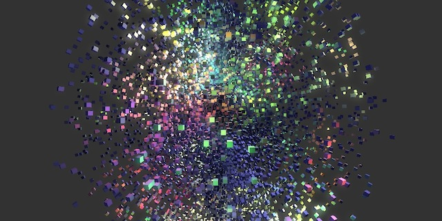

## Nebula3/emscripten Demos

These are Nebula3 engine demos cross-compiled to Javascript+WebGL using 
<a href="https://github.com/kripken/emscripten" target="_blank">emscripten</a>. Please use
an uptodate WebGL-enabled browser (Chrome or Firefox)

All assets used by courtesy of <a href="http://www.drakensang.com" target="_blank">Drakensang Online</a>,
the game I'm working on during day time.

Here's some annotated highlevel source code if you want to understand what's going on
in those demos: <a href="sources.html">Source Code</a>.

## Dragons

Renders a lot of dragons (add more dragons with the <b>cursor up</b> key). Tests Javascript and WebGL 
draw call performance. Animations and joint skeletons are evaluated in Javascript indidually for each dragon.
One dragon needs 2 uniform updates and 1 draw-call per geometry pass, the character model has
54 joints and 3.1k triangles. At 961 dragons, this means: 52k joints animated and evaluated,
~6 million triangles rendered, and 1922 draw calls.

    

    
<a href="demos/dragons_asmjs.html">Click here for Dragons Demo</a>

cursor up: more dragons 
cursor down: less dragons 
space: reset camera 

## Drakensang Online Map Viewer

This is the map rendering code from the Drakensang Online client with correct realtime 
lighting and a few animated characters thrown in, plus collision test. Move the player 
ghoul around by clicking or holding the left mouse button. The demo tests mainly
WebGL performance, there are about 3k WebGL calls per frame.

    

    
<a href="demos/dsomapviewer_asmjs.html">Click here for Map Viewer Demo</a>

Move around with left-mouse-button.

## Drakensang Online Character Model Viewer

Display a selection of Drakensang Online character models and animations.

    

    
<a href="demos/dsocharviewer_asmjs.html">Click here for Char Viewer Demo</a>

cursor up: next character 
cursor down: previous character 
cursor left: next animation 
cursor right: next skin 

## Instancing Test

This tests the fake instance-rendering I implemented for platforms without hardware instancing
support. This uses "unrolled" vertex- and index-buffers, and a vertex shader matrix palette with
instance transforms. Currently renders up to 64 instances in a single draw-call (limited by
number of vertex uniforms, which is 254 in ANGLE). Position and orientation of each cube instance
is computed in JS (a conversion from polar to cartesian space, and a matrix-lookat).

    

    
<a href="demos/instancing_asmjs.html">Click here for Instancing Demo</a>

cursor up: more cubes 
cursor down: less cubes 
space: DISCO! 

