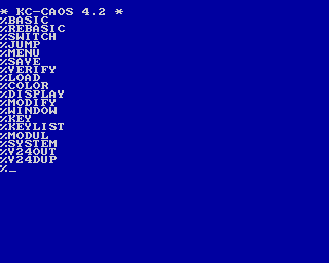
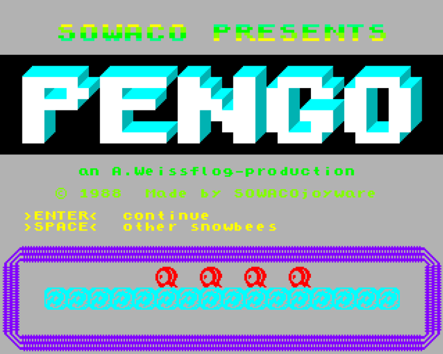

## The East-German 8-Bitters

This page contains information about the East-German 8-bit computers I grew up with, including live emulator demos running directly in the browser. Later I'll try to upload scans and photos of all the stuff I still have stashed under the roof (computers, manuals, program listings and a lot of "programmer art" from 1984 to 1990).

The black magic of running those emulators directly in the browser is possible through 4 OpenSource projects: first and foremost, there's <a href="http://www.mess.org" target="_blank">MESS</a>, the absolutely epic Multi-Emulator-Super-System which can emulate over 600 computer systems, then there's <a href="https://github.com/kripken/emscripten" target="_blank">emscripten</a>, which compiles C++ code to Javascript. Mentioning emscripten also requires to give props to <a href="http://www.llvm.org" target="_blank">LLVM</a>, which is the modular compiler system which emscripten is built on top. And finally there's <a href="http://jsmess.textfiles.com" target="_blank">JSMESS</a>, which puts everything together and enables running MESS in the browser.

My changes to the JSMESS source code are on github. If my changes are general improvements to JSMESS I'll try to package them into pull requests for the main branch. Some changes are dirty hacks though which better remain in my own fork: <a href="http://www.github.com/floooh/jsmess">http://www.github.com/floooh/jsmess</a>

## The KC85/3

Compared to the other East-German 8-bit computers at the time, the KC85/3 was a wonder-machine. It could render colorful pixel graphics at 320x256 resolution and had a fast 1.75MHz Z80 CPU (or more precisely the GDR clone called U880):

    

    
<a href="oldstuff/kc85_3/kc85_3.html">Click to go to the KC85/3 emulator page</a>

## The KC85/4

The KC85/4 was the successor to the KC85/3, and mainly had more RAM and better graphics specs. Access to video memory was faster, the video memory layout made more sense, and the color "pixel" resolution was 4x higher (each block of 8x1 pixels could be assigned one foreground and one background color, instead of blocks of 8x4 pixels on the KC85/3). CPU speed was the same at
1.75 MHz:

    

    
<a href="oldstuff/kc85_4/kc85_4.html">Click to go to the KC85/4 emulator page</a>

## KC Games

Here are a few games I coded on the KC85/3 as a kid (unfortunately most don't work yet in MESS/JSMESS):

	

    
<a href="oldstuff/pengo/pengo.html">Click to play Pengo</a>

